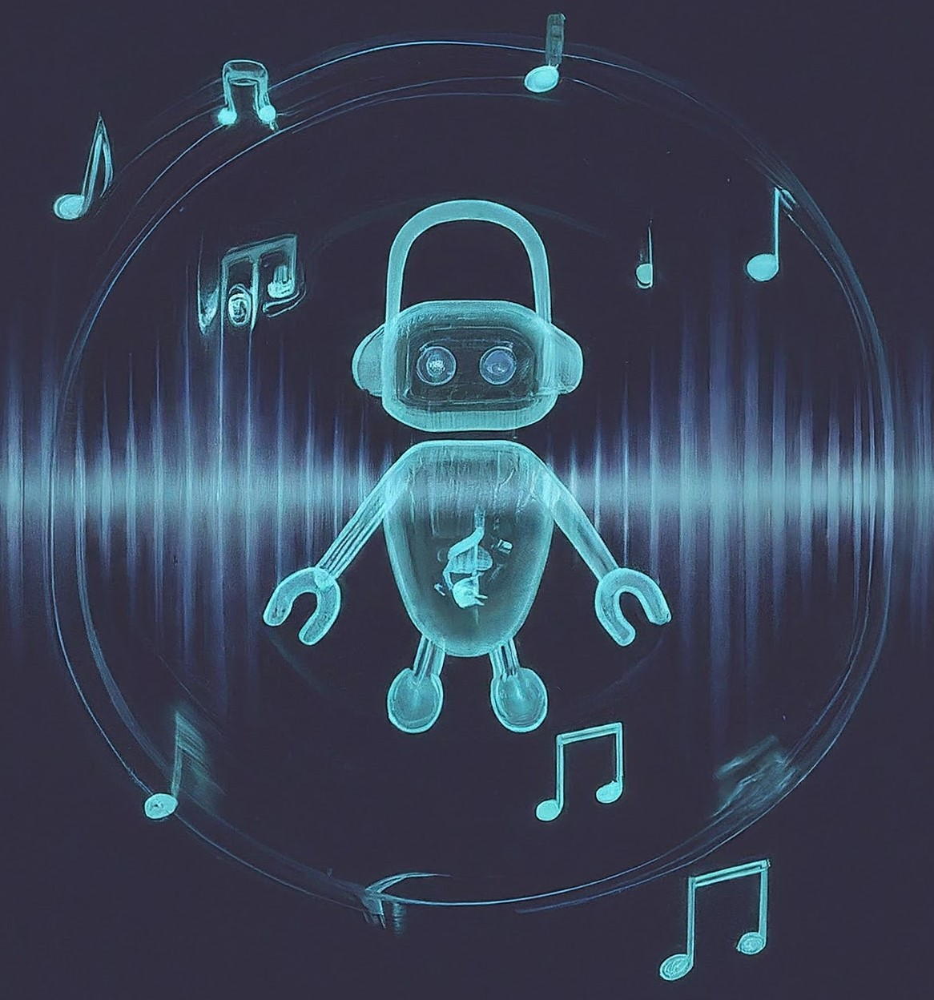

# Discord Music Bot


Discord Music Bot is a versatile Discord bot designed to enhance your server's music experience. With this bot, you can play music from YouTube, manage music queues, control playback, and more.

## Features

- **Play Music**: Play music from YouTube by providing a video URL.
- **Manage Queue**: Add, remove, and view the music queue.
- **Control Playback**: Skip songs, pause/resume playback, and stop the music.
- **Volume Control**: Adjust the volume of the music playback.
- **Now Playing**: Display the currently playing song.
- **Help Command**: Get information about available bot commands.

## Installation

To use Discord Music Bot, follow these steps:

1. **Clone the repository:**
    ```bash
    git clone https://github.com/PrathamS1/Smart-Calendar-Task-Scheduler.git
    ```
2. **Install dependencies:**
    ```bash
    npm install
    ```
    ```bash
    npm install discord.js@latest
    ```
    ```bash
    npm install libsodium-wrappers
    ```
3. **Add your Discord bot token in the code:**
    ```
    Line 19: const token = 'Enter Your Bot Token Here';
    ```
4. **Enable Intents**
    1. Go to the Discord Developer Portal and select your application.
    2. Navigate to the "Bot" section.
    3. Enable the following intents:
        * Privileged Gateway Intents: Turn on Message Content Intent, Presence Intent, and Server Members Intent.
5. **Add Bot to your server**
    1. **Generate an OAuth2 URL:**
    In the OAuth2 section of your application in the Discord Developer Portal, generate a URL with the bot scope and the Administrator permission.

    2. **Invite the Bot:**
    Open the generated URL in your browser and invite the bot to your server.
4. **Start the bot:**
    ```bash
    node index.js
    ```
## Usage
Once the bot is running and connected to your Discord server, join a voice channel and can use the following commands in a text channel:

- `!play <YouTube_URL>`: Play a song from YouTube.
- `!skip`: Skip the current song.
- `!stop`: Stop the music and clear the queue.
- `!pause`: Pause the currently playing song.
- `!resume`: Resume the paused song.
- `!queue`: Show the current music queue.
- `!remove <song_number>`: Remove a song from the queue.
- `!clear`: Clear the entire queue.
- `!volume <0-1>`: Set the volume (between 0 and 1).
- `!nowplaying`: Show the currently playing song.
- `!help`: Show available bot commands.

## Contributing

Contributions are welcome! If you have any suggestions, bug reports, or feature requests, please open an issue or submit a pull request.

## License

This project is licensed under the [MIT License](LICENSE).
